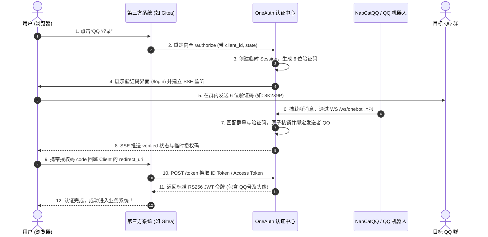

# 📖 OneAuth 完整架构与使用指南

> **定位**: 基于 QQ 群验证码的轻量级、单二进制 OpenID Connect (OIDC) 统一身份认证中心  
> **核心栈**: Go 1.22+（现代标准库 ServeMux）+ 纯 Go SQLite WAL 驱动 (`modernc.org/sqlite`) + RS256 JWT (`golang-jwt/jwt/v5`) + WebSocket (`gorilla/websocket`)  
> **发布形态**: 跨平台单二进制文件（Windows / Linux x86_64 / Linux ARM64）与 Docker 容器  

---

## 目录
1. [系统架构与原理](#1-系统架构与原理)
2. [协议兼容与接口定义](#2-协议兼容与接口定义)
3. [快速部署指引](#3-快速部署指引)
   - [二进制直接运行 (Windows / Linux)](#31-二进制直接运行-windows--linux)
   - [Systemd 服务守护 (生产推荐)](#32-systemd-服务守护-生产推荐)
   - [Docker / Docker Compose 部署](#33-docker--docker-compose-部署)
   - [反向代理配置 (Nginx / Caddy)](#34-反向代理配置-nginx--caddy)
4. [OneBot 机器人对接 (NapCatQQ)](#4-onebot-机器人对接-napcatqq)
5. [第三方应用接入实战](#5-第三方应用接入实战)
   - [Gitea / Forgejo](#51-gitea--forgejo)
   - [Nextcloud](#52-nextcloud)
   - [Grafana](#53-grafana)
6. [管理后台操作指南](#6-管理后台操作指南)
7. [常见故障排查 Runbook](#7-常见故障排查-runbook)

---

## 1. 系统架构与原理

OneAuth 将传统繁琐的 OAuth 授权流程转换为安全直观的“群内一次性验证码”核验机制。

```
+-----------------------------------------------------------------------------------------+
|                                    OneAuth 进程空间                                     |
|                                                                                         |
|  [ OIDC 协议端点 ]                                                                       |
|  - GET  /.well-known/openid-configuration                                               |
|  - GET  /.well-known/jwks.json                                                          |
|  - GET  /authorize ──> (校验 client_id/redirect_uri) ──> 创建会话 ──> 重定向 /login       |
|  - GET  /api/session/stream ──> 建立 SSE 长连接实时监听核销状态                         |
|  - POST /token ──> 校验 AuthCode/PKCE ──> 签发 RS256 JWT ID Token                       |
|  - GET  /userinfo ──> 解析 Bearer JWT ──> 响应用户资料                                  |
|                                                                                         |
|  [ OneBot 微内核 ]                                                                      |
|  - WS   /ws/onebot ──> 接收 NapCatQQ 反向 WS 消息 ──> 过滤群号 ──> 提取 6 位验证码      |
|                                                     │                                   |
|                                                     ▼                                   |
|  [ 瞬态内存状态机 (In-Memory Engine) ]                                                  |
|  - sync.RWMutex 高并发安全读写                                                          |
|  - 验证码与会话原子绑定与核销（防重放攻击）                                             |
|  - 状态广播：原子变更触发 SSE 通道即时推送 ──> 前端 1 秒内无感跳转                      |
|  - 20 秒轮询惰性 GC 自动回收过期失效会话                                                |
|                                                                                         |
|  [ 持久化层 (SQLite WAL) ]                                                               |
|  - 存储 OIDC 客户端、系统配置、管理员账号凭证                                            |
+-----------------------------------------------------------------------------------------+
```

### 认证全流程时序图



---

## 2. 协议兼容与接口定义

### 2.1 核心 OIDC 端点

| 请求方法 | 路径 | 功能说明 | 认证要求 |
|---|---|---|---|
| `GET` | `/.well-known/openid-configuration` | OpenID Connect 自动发现元数据文档 | 公开 |
| `GET` | `/.well-known/jwks.json` | RS256 签名公钥 JWKS 集合 | 公开 |
| `GET` | `/authorize` | OAuth2 授权端点（支持 PKCE S256） | 公开 |
| `POST` | `/token` | 授权码换取令牌端点 | HTTP Basic 或 POST Form (`client_secret` 或 `code_verifier`) |
| `GET` | `/userinfo` | 获取用户资料端点 | `Authorization: Bearer <access_token>` |
| `GET` | `/login` | 用户前台验证码核销页面 | 携带 `session_id` |
| `GET` | `/api/session/stream` | Server-Sent Events (SSE) 状态推送流 | 携带 `session_id` |
| `WS` | `/ws/onebot` | OneBot v11/v12 反向 WebSocket 接收端点 | 可选 URL Query `?access_token=` 鉴权 |

### 2.2 JWT Claims 规范 (ID Token)
```json
{
  "iss": "https://auth.example.com",
  "sub": "123456789",
  "aud": "client_abc123",
  "exp": 1758999999,
  "iat": 1758996399,
  "name": "QQ用户_123456789",
  "preferred_username": "123456789",
  "email": "123456789@qq.com",
  "email_verified": true,
  "picture": "https://q1.qlogo.cn/g?b=qq&nk=123456789&s=640"
}
```

---

## 3. 快速部署指引

### 3.1 二进制直接运行 (Windows / Linux)

OneAuth 采用零依赖设计，静态打包，无需安装任何系统运行库。

#### 环境变量列表
| 变量名 | 默认值 | 说明 |
|---|---|---|
| `PORT` | `9000` | 监听端口 |
| `DB_PATH` | `oneauth.db` | SQLite 数据库文件落盘路径 |
| `KEY_PATH` | `oneauth_rsa.pem` | RSA 2048 签名私钥路径（首次启动自动创建） |

#### Windows 启动
双击 `oneauth.exe` 或在终端执行：
```powershell
.\oneauth.exe
```

#### Linux 启动 (x86_64 或 ARM64)
```bash
# 赋予可执行权限
chmod +x oneauth-linux-amd64

# 启动服务
PORT=9000 DB_PATH=/opt/oneauth/data/oneauth.db KEY_PATH=/opt/oneauth/data/oneauth_rsa.pem ./oneauth-linux-amd64
```

---

### 3.2 Systemd 服务守护 (生产推荐)

在 Linux 服务器上创建服务文件 `/etc/systemd/system/oneauth.service`：

```ini
[Unit]
Description=OneAuth OIDC Identity Provider
After=network.target

[Service]
Type=simple
User=root
WorkingDirectory=/opt/oneauth
ExecStart=/opt/oneauth/oneauth-linux-amd64
Restart=always
RestartSec=5
Environment=PORT=9000
Environment=DB_PATH=/opt/oneauth/oneauth.db
Environment=KEY_PATH=/opt/oneauth/oneauth_rsa.pem

# 资源保护与安全加固
LimitNOFILE=65536

[Install]
WantedBy=multi-user.target
```

启动并设置开机自启：
```bash
sudo systemctl daemon-reload
sudo systemctl enable --now oneauth
sudo systemctl status oneauth
```

---

### 3.3 Docker / Docker Compose 一键部署

Docker Compose 能够**一行命令同时启动两个容器**：
1. **`oneauth` 容器**：OIDC 认证中心核心服务（对外暴露 `9000` 端口）。
2. **`napcat` 容器**：NapCatQQ 机器人容器（官方无头 Linux QQ，对外暴露 `6099` WebUI 端口用于扫码登录 QQ）。

两个容器通过内置虚拟网络 `oneauth-net` 互联通信，NapCat 直接通过内部网络地址 `ws://oneauth:9000/ws/onebot` 上报消息，无需暴露额外内网端口。

---

#### 步骤 1：准备与修改配置文件
在项目根目录编辑 [docker-compose.yml](file:///D:/amnssb/Documents/OneAuth/docker-compose.yml)：
将 `ACCOUNT` 改为你准备作为机器人的 QQ 号：
```yaml
version: '3.8'

services:
  oneauth:
    image: oneauth:latest
    build:
      context: .
      dockerfile: Dockerfile
    container_name: oneauth
    restart: unless-stopped
    ports:
      - "9000:9000"           # 访问管理后台和 OIDC 的宿主机端口
    volumes:
      - oneauth-data:/data     # 持久化存储 SQLite 数据库与 RSA 私钥
    environment:
      - TZ=Asia/Shanghai
      - PORT=9000
      - DB_PATH=/data/oneauth.db
      - KEY_PATH=/data/oneauth_rsa.pem
    networks:
      - oneauth-net

  napcat:
    image: mlikiowa/napcat-docker:latest
    container_name: napcat
    restart: always
    environment:
      - NAPCAT_GID=0
      - NAPCAT_UID=0
      - ACCOUNT=123456789      # ⚠️ 替换为你自己的机器人 QQ 号
    volumes:
      - napcat-data:/app/.config/QQ
      - napcat-config:/app/napcat/config
    ports:
      - "6099:6099"           # 浏览器访问此端口扫码登录 QQ
    networks:
      - oneauth-net

volumes:
  oneauth-data:
  napcat-data:
  napcat-config:

networks:
  oneauth-net:
    driver: bridge
```

---

#### 步骤 2：一条命令构建并启动
在项目根目录下执行：
```bash
docker compose up -d --build
```
> **说明**：首次运行会自动根据 `Dockerfile` 打包仅约 30MB 的 OneAuth 极小镜像，并自动拉取 NapCatQQ 镜像。

---

#### 步骤 3：扫码登录机器人 QQ
1. 打开浏览器访问：`http://<服务器IP>:6099/webui`
2. 使用手机 QQ 扫描网页中的二维码，确认机器人 QQ 账号登录。

---

#### 步骤 4：在 NapCat 中配置反向 WebSocket 连接
机器人登录成功后，在 NapCat 的 WebUI 配置页面中：
1. 点击 **网络配置** → **添加反向 WebSocket**。
2. 填入参数：
   - **连接地址 (URL)**：`ws://oneauth:9000/ws/onebot`（⚠️ 注意：容器间通信直接写容器名 `oneauth` 即可，**不要**写 `localhost`）
   - **Access Token**：填写在 OneAuth 控制台中设置的 `onebot_token`（如果设置了的话）
   - **重连时间**：`3000` 毫秒
3. 保存并启用配置。

---

#### 步骤 5：进入 OneAuth 管理后台完成初始化
1. 打开浏览器访问：`http://<服务器IP>:9000/admin`
2. 首次登录账号为 `admin`，密码为 `admin123`（进入后可在「安全中心」修改）。
3. 在「OneBot 节点」页面将**目标审核 QQ 群号**设置为你的目标群号。
4. 部署完毕！现在在业务系统中（如 Gitea）点击 QQ 登录，群内发验证码即可完成跳转。

---

#### 常用维护命令
```bash
# 查看所有容器运行状态
docker compose ps

# 查看 OneAuth 实时运行日志
docker compose logs -f oneauth

# 查看 NapCat 机器人运行日志
docker compose logs -f napcat

# 停止并退出所有容器
docker compose down

# 重启服务
docker compose restart
```

---

### 3.4 反向代理配置 (Nginx / Caddy)

生产环境下必须配置 HTTPS，保证 OAuth Token 和 SSE 连接的安全。

#### Nginx 配置示例
> **注意**: SSE 端点与 WebSocket 必须禁用反向代理缓冲，开启长连接。

```nginx
server {
    listen 80;
    server_name auth.yourdomain.com;
    return 301 https://$host$request_uri;
}

server {
    listen 443 ssl http2;
    server_name auth.yourdomain.com;

    ssl_certificate     /etc/letsencrypt/live/auth.yourdomain.com/fullchain.pem;
    ssl_certificate_key /etc/letsencrypt/live/auth.yourdomain.com/privkey.pem;

    # 传递真实 Host 供 OIDC 动态构建 Issuer
    proxy_set_header Host $host;
    proxy_set_header X-Real-IP $remote_addr;
    proxy_set_header X-Forwarded-For $proxy_add_x_forwarded_for;
    proxy_set_header X-Forwarded-Proto https;

    # 1. 基础接口代理
    location / {
        proxy_pass http://127.0.0.1:9000;
    }

    # 2. SSE 流式响应（必须关闭缓冲）
    location /api/session/stream {
        proxy_pass http://127.0.0.1:9000;
        proxy_buffering off;
        proxy_cache off;
        proxy_set_header Connection '';
        proxy_http_version 1.1;
        chunked_transfer_encoding off;
        proxy_read_timeout 600s;
    }

    # 3. OneBot 反向 WebSocket
    location /ws/onebot {
        proxy_pass http://127.0.0.1:9000;
        proxy_http_version 1.1;
        proxy_set_header Upgrade $http_upgrade;
        proxy_set_header Connection "upgrade";
        proxy_read_timeout 86400s;
        proxy_send_timeout 86400s;
    }
}
```

#### Caddy 配置示例
```caddy
auth.yourdomain.com {
    reverse_proxy 127.0.0.1:9000 {
        header_up Host {host}
        header_up X-Real-IP {remote_host}
        header_up X-Forwarded-Proto https
    }
}
```

---

## 4. OneBot 机器人对接 (NapCatQQ)

1. 打开 NapCatQQ WebUI (`http://<ip>:6099`) 并登录机器人账号。
2. 进入 **网络配置** → **添加反向 WebSocket 服务**：
   - **URL**: `ws://oneauth:9000/ws/onebot`（同容器网络）或 `ws://127.0.0.1:9000/ws/onebot`
   - **Access Token**: 填写在 OneAuth 控制台设置的 `onebot_token`。
   - **重连间隔**: `3000` ms。
3. 保存后查看 OneAuth 管理后台系统概览，确认反向 WS 状态正常。
4. 将机器人拉入目标 QQ 群，并在管理后台设置该群号。

---

## 5. 第三方应用接入实战

### 5.1 Gitea / Forgejo
1. 以管理员进入 Gitea：**管理面板** → **认证来源** → **添加认证来源**。
2. 填写参数：
   - **认证类型**: `OAuth2`
   - **认证名称**: `QQ一键认证`
   - **OAuth2 提供商**: `OpenID Connect 1.0`
   - **客户端 ID**: 填写在 OneAuth 中注册的 Client ID
   - **客户端密钥**: 填写注册时生成的 Client Secret
   - **OpenID Connect 自动发现 URL**: `https://auth.yourdomain.com/.well-known/openid-configuration`
   - **附加 Scopes**: `openid profile email`
3. 保存并测试登录。

---

### 5.2 Nextcloud
1. 在 Nextcloud 应用中心启用 **Social Login** 插件。
2. 进入 **管理设置** → **Social login** → **Custom OIDC** 添加：
   - **Title**: `QQ 统一认证`
   - **Authorize URL**: `https://auth.yourdomain.com/authorize`
   - **Token URL**: `https://auth.yourdomain.com/token`
   - **User Info URL**: `https://auth.yourdomain.com/userinfo`
   - **Client ID & Secret**: 填写 OneAuth 客户端信息
   - **Scope**: `openid profile email`

---

### 5.3 Grafana
在 `grafana.ini` 中添加配置：
```ini
[auth.generic_oauth]
enabled = true
name = OneAuth
client_id = YOUR_CLIENT_ID
client_secret = YOUR_CLIENT_SECRET
scopes = openid profile email
auth_url = https://auth.yourdomain.com/authorize
token_url = https://auth.yourdomain.com/token
api_url = https://auth.yourdomain.com/userinfo
auto_login = false
```

---

## 6. 管理后台操作指南

- **后台地址**: `/admin`
- **默认账号**: `admin`
- **默认密码**: `admin123`（初次登录后请在「🛡️ 安全中心」及时修改）

### 核心功能区说明：
1. **系统概览**: 实时监控 OIDC 协议端点、节点运行时效、已注册客户端总数。
2. **系统设置**: 自定义站点名称、群验证提示文案、毛玻璃背景图片直链及前台 CSS 样式。
3. **应用管理**: 创建和吊销信任的 OIDC 应用凭证（Client ID / Client Secret），维护 Redirect URIs 回调白名单。
4. **OneBot 节点**: 配置目标核验群号、反向 WS 鉴权 Token 以及验证码 TTL 生存周期。
5. **安全中心**: 快速修改管理员访问密码。

---

## 7. 常见故障排查 Runbook

### Q1: 页面显示“会话不存在或已过期”？
- **原因**: 用户打开了旧的 `/login` 链接，或者该验证码已超时未核验。
- **解决**: 让用户从业务系统重新点击“登录”发起全新的 `/authorize` 请求。

### Q2: 群内发送验证码后，前端页面没有跳转？
1. **检查群号**: 确认用户发送消息的 QQ 群号与管理后台设置的 `target_group_id` 完全一致。
2. **检查 Bot 日志**: 确认 NapCat 反向 WebSocket 是否已成功连接到 `/ws/onebot`，并有消息上报日志。
3. **检查 Token**: 如果配置了 `onebot_token`，确保 NapCat 的 WS 握手 URL 或 Header 正确携带该凭证。
4. **检查反代缓冲**: Nginx 反代环境下必须确认 `proxy_buffering off;`，否则 SSE 推送事件会被 Nginx 缓存而无法即时到达前端。

### Q3: 业务系统报错“Token 校验失败”？
- 确认业务系统服务器能够正常访问 OneAuth 的 `/.well-known/jwks.json` 端点以获取公钥，并确保系统时间与标准 NTP 时间保持同步。
